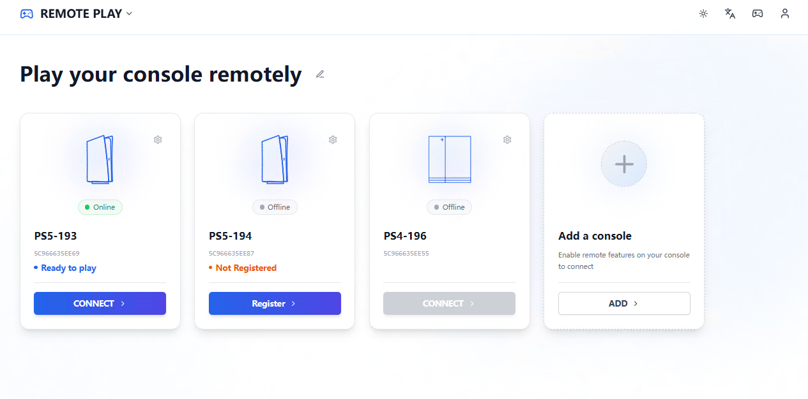
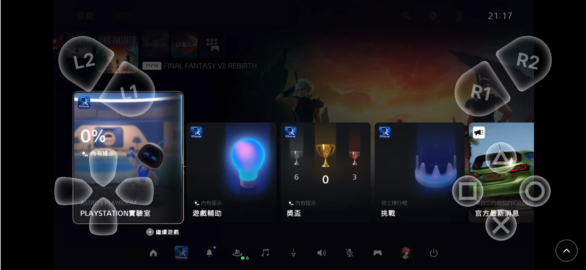

# Remote Play
中文 | [EN](README.md)
## 项目简介
PSRP 是一个自托管解决方案，允许您直接在网页浏览器中串流和游玩 PlayStation 游戏。它将您的 PlayStation 主机桥接到任何支持现代浏览器的设备，提供低延迟串流和完整的手柄支持。

## 功能

| 功能 | 描述 |
|------|------|
| **手柄支持** | 支持物理手柄/摇杆、移动端触摸虚拟控制器，以及可自定义的键盘到控制器按键映射 |
| **主机注册** | 使用 PIN 码轻松注册 PlayStation 主机，支持自动设备发现 |
| **移动端适配** | 针对移动设备优化的体验，包含触摸虚拟控制器和响应式 UI 设计 |

## 界面预览

### 设备总览


### 串流界面


### 视频演示
https://github.com/user-attachments/assets/0a8f075f-7577-4fbc-bdd2-e6741669eb2d


## 快速开始

推荐使用 Docker Compose 进行部署（见下方）。如需手动安装，您需要：
- Docker 和 Docker Compose
- PostgreSQL 数据库（或使用包含的 PostgreSQL 容器）
- 基本的 Docker 和网络知识

## Docker Compose 部署

推荐使用 Docker Compose 部署 PSRP。以下配置将设置所有必需的服务：

```yaml
version: "3.9"

services:
  postgres:
    image: postgres:16
    container_name: postgres
    restart: unless-stopped
    environment:
      - POSTGRES_DB=remoteplay
      - POSTGRES_USER=remoteplay
      - POSTGRES_PASSWORD=remoteplay
    healthcheck:
      test: ["CMD-SHELL", "pg_isready -U remoteplay -d remoteplay"]
      interval: 5s
      timeout: 5s
      retries: 5
    volumes:
      - postgres-data:/var/lib/postgresql/data

  frontend:
    image: ghcr.io/o1298098/remote-play/web
    container_name: web
    restart: unless-stopped
    environment:
      - API_PROXY_URL=http://backend:8080
    ports:
      - "10110:80"
    networks:
      - default

  backend:
    image: ghcr.io/o1298098/remote-play/server
    container_name: server
    restart: unless-stopped
    environment:
      - ASPNETCORE_ENVIRONMENT=Production
      - Database__HOST=postgres
      - Database__PORT=5432
      - Database__NAME=remoteplay
      - Database__USER=remoteplay
      - Database__PASSWORD=remoteplay
      - WebRTC__IcePortMin=40200
      - WebRTC__IcePortMax=40400
      - WebRTC__PublicIp=192.168.100.186
      - WebRTC__TurnServers__0__Url=turn:stun.cloudflare.com:3478?transport=udp
      # - WebRTC__TurnServers__0__Username=<turn-username>
      # - WebRTC__TurnServers__0__Credential=<turn-password>
      # - JWT__Secret=change-me-to-a-strong-secret
      # - TZ=Asia/Shanghai
    ports:
      - "10111:8080"
      - "40200-40400:40200-40400/udp"
    depends_on:
      postgres:
        condition: service_healthy
      dbtool:
        condition: service_completed_successfully
    networks:
      lan:
        ipv4_address: 192.168.50.33
      default:

  dbtool:
    image: ghcr.io/o1298098/remote-play/dbtool
    container_name: dbtool
    restart: "no"
    environment:
      - Database__HOST=postgres
      - Database__PORT=5432
      - Database__NAME=remoteplay
      - Database__USER=remoteplay
      - Database__PASSWORD=remoteplay
    healthcheck:
      test: ["CMD-SHELL", "exit 0"]
      interval: 1s
      retries: 1
    networks:
      - default
    depends_on:
      postgres:
        condition: service_healthy

networks:
  default:
    driver: bridge
  lan:
    driver: macvlan
    driver_opts:
      #请把eth0替换为实际与Playstaion同一网络的网口
      parent: eth0
    ipam:
      config:
        - subnet: 192.168.50.0/24
          gateway: 192.168.50.1
volumes:
   postgres-data:
```

### 部署步骤

1. **调整配置** 在 `docker-compose.yml` 文件中：
   - 将 `WebRTC__PublicIp` 更新为您的服务器公网 IP 地址
   - 修改 `lan` 网络设置以匹配您的网络接口（将 `eth0` 替换为实际网络接口）
   - 根据需要更新子网和网关
   - （可选）为生产环境设置 TURN 服务器凭证和 JWT 密钥

2. **启动服务**：
   ```bash
   docker compose up -d
   ```

3. **访问 Web 界面**：
   - 前端：`http://您的服务器IP:10110`
   - 后端 API：`http://您的服务器IP:10111`

4. **注册 PlayStation 主机**：
   - 打开 Web 界面
   - 点击"添加设备"以发现您的 PlayStation 主机
   - 输入 PlayStation 屏幕上显示的 PIN 码
   - 您的主机将被注册并可以使用

### 重要提示

- 确保 `lan` 网络接口与您的物理网络适配器匹配
- 后端需要与您的 PlayStation 主机在同一网络中
- 如需远程访问，请配置端口转发和 TURN 服务器
- 在生产环境部署前，请更改默认 JWT 密钥

## 贡献指南
欢迎通过 Issue、Pull Request 或 Discussions 参与共建。提交前建议：
- 关联对应的问题描述或架构背景。
- 为新增或修改的功能补充文档与配置示例。
- 说明手动或自动化测试结果，确保行为可复现。

## 许可协议
本项目以 MIT License 授权发布，详情请参阅仓库根目录下的 `LICENSE` 文件。

---

> PlayStation 主机握手与认证流程在实现时参考了社区项目 [pyremoteplay](https://github.com/ktnrg45/pyremoteplay) 提供的协议分析。

> 文档最后更新：2025-11-10。如有疑问或改进建议，欢迎提交 Issue。

